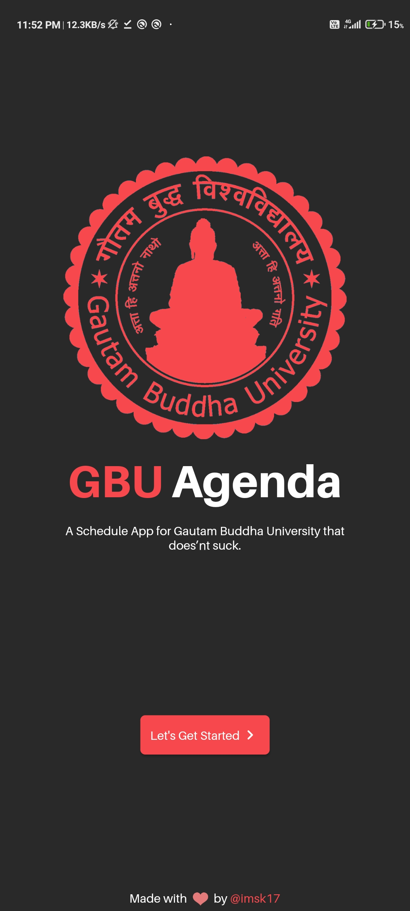
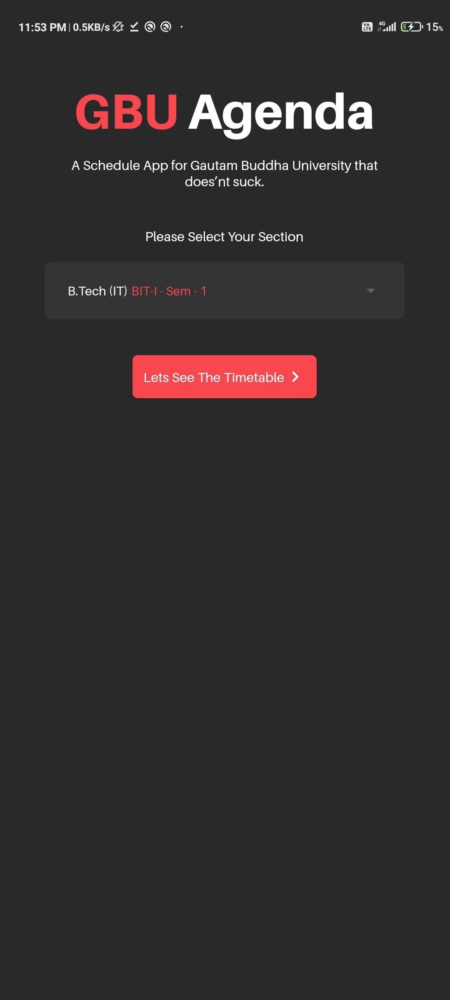

# GbuAgenda

A New Schedule App for Gautam Buddha University that does'nt suck.

## Download

Latest Releases Can be Found in This Repo's Releases Section.

## Screenshots

#### Welcome Screen
 

#### School Screen


#### Section Screen


#### Timetable Screen


GBUAgenda is an app that attempts to use the latest cutting edge libraries and tools. As a summary:

- Uses [Riverpod](https://riverpod.dev) for State Management needs.
- Uses [GetIt](https://pub.dev/packages/get_it) for Dependency Injection.

## Development setup

First off, you require the Latest Android Studio and The Flutter SDK to be able to build the app. You will also need to host your own [Backend](https://github.com/imsk17/GBU-Agenda-Backend)

### Code style

This project uses [lint](https://pub.dev/packages/lint), for Linting in Dart.

If you find that one of your pull reviews does not pass the CI server check due to a code style conflict, you can
easily fix it by running: `flutter format --set-exit-if-changed . && flutter analyze .`

## Flutter development

GBUAgenda is an app that attempts to use the latest cutting edge libraries and tools. As a summary:

- Uses [Riverpod](https://riverpod.dev) for State Management needs.
- Uses [GetIt](https://pub.dev/packages/get_it) for Dependency Injection.

## Contributions

If you've found an error in this sample, please file an issue.

Patches are encouraged and may be submitted by forking this project and
submitting a pull request.

## License

```
MIT License

Copyright (c) 2021 Sumit Kumar

Permission is hereby granted, free of charge, to any person obtaining a copy
of this software and associated documentation files (the "Software"), to deal
in the Software without restriction, including without limitation the rights
to use, copy, modify, merge, publish, distribute, sublicense, and/or sell
copies of the Software, and to permit persons to whom the Software is
furnished to do so, subject to the following conditions:

The above copyright notice and this permission notice shall be included in all
copies or substantial portions of the Software.

THE SOFTWARE IS PROVIDED "AS IS", WITHOUT WARRANTY OF ANY KIND, EXPRESS OR
IMPLIED, INCLUDING BUT NOT LIMITED TO THE WARRANTIES OF MERCHANTABILITY,
FITNESS FOR A PARTICULAR PURPOSE AND NONINFRINGEMENT. IN NO EVENT SHALL THE
AUTHORS OR COPYRIGHT HOLDERS BE LIABLE FOR ANY CLAIM, DAMAGES OR OTHER
LIABILITY, WHETHER IN AN ACTION OF CONTRACT, TORT OR OTHERWISE, ARISING FROM,
OUT OF OR IN CONNECTION WITH THE SOFTWARE OR THE USE OR OTHER DEALINGS IN THE
SOFTWARE.
```
